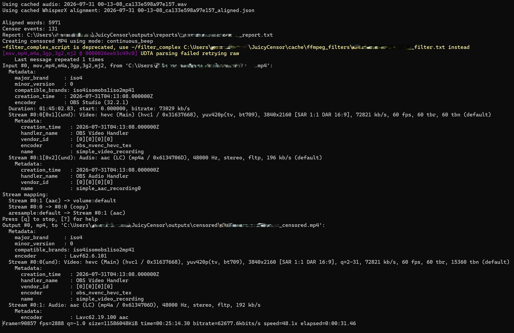
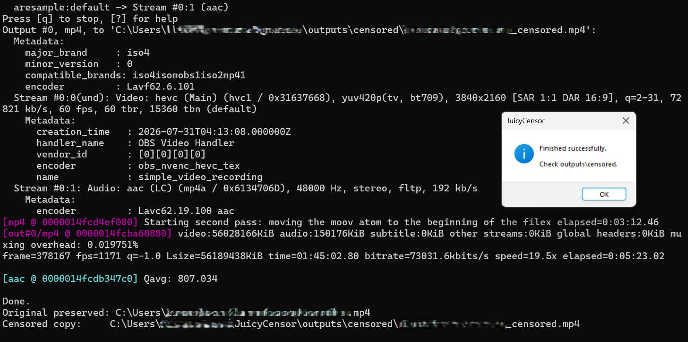
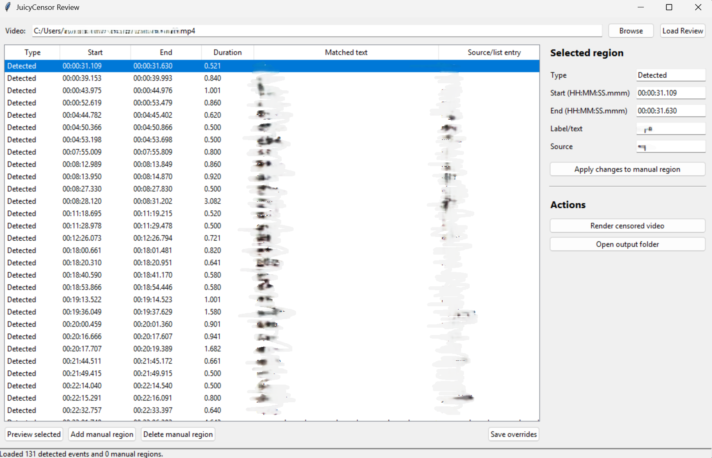

# JuicyCensor

**Version 1.0.0**

GPU-accelerated video profanity censor using **WhisperX**, **forced word alignment**, and **FFmpeg**.

JuicyCensor automatically detects profane words and phrases, creates a censored copy of your video, and includes a review application for correcting missed detections before rerendering.

---

## Supported Platform

- Windows 10
- Windows 11
- Python 3.12

---

# Screenshots

## Main Application



---

## Processing

JuicyCensor automatically analyzes the selected video, detects profanity using WhisperX, generates a censorship report, and creates a censored copy while preserving the original file.



---

## Review Application



---

# Features

- GPU-accelerated WhisperX transcription
- Word-level forced alignment
- Automatic profanity detection
- Continuous, pulse, custom beep, and mute censor modes
- Manual review and correction GUI
- Preview individual censor regions before rendering
- Add manual censor regions for missed dialogue
- Cached transcriptions for fast rerenders
- Works with long videos
- Generates censorship reports
- Drag-and-drop video support

---

# Requirements

Before using JuicyCensor, install:

- Python **3.12.x**
- FFmpeg (must be available in your system PATH)

Optional (recommended):

- NVIDIA GPU with CUDA-compatible PyTorch for significantly faster transcription

Git is only required if cloning the repository.

---

# Installation

Clone the repository:

```bash
git clone https://github.com/seagullslayer7/JuicyCensor.git
cd JuicyCensor
```

Create a virtual environment:

```bash
python -m venv venv
```

Activate it:

### Windows

```powershell
venv\Scripts\activate
```

Install dependencies:

```bash
pip install -r requirements.txt
```

Verify your installation:

```text
setup_check.bat
```

If the setup check passes, launch JuicyCensor:

```text
run.bat
```

or

```text
JuicyCensor.exe
```

> **Note:** FFmpeg must be installed and available in your system PATH before running JuicyCensor.

---

# Building from Source

To rebuild the Windows executables:

Main application

```text
build_launcher_exe.bat
```

Review application

```text
build_review_exe.bat
```

To remove previous PyInstaller build artifacts:

```text
clean_build_artifacts.bat
```

---

# Main Applications

## JuicyCensor.exe

The primary application used to censor videos.

You can:

- Double-click to choose a video
- Drag and drop a video onto the executable

During processing JuicyCensor will:

1. Extract audio
2. Transcribe using WhisperX
3. Perform forced alignment
4. Detect banned words and phrases
5. Generate a censorship report
6. Render a censored MP4

---

## JuicyCensor Review.exe

The review application lets you inspect every detected censor event before rendering.

You can:

- Browse detected regions
- Preview individual events
- Add manual censor regions
- Edit incorrect timestamps
- Save manual overrides
- Render an updated censored video without retranscribing

---

# First-Time Processing

The first run performs the expensive work.

1. Open a video with JuicyCensor.
2. WhisperX extracts audio.
3. WhisperX generates a transcript.
4. Forced alignment assigns timestamps to every word.
5. Results are cached.

Future renders of the same video reuse the cached alignment, making rerenders much faster.

---

# Review Workflow

1. Open **JuicyCensor Review.exe**
2. Select the original source video.
3. Click **Load Review**.
4. Select a detected event.
5. Preview the region if desired.
6. For missed dialogue, click **Add Manual Region**.
7. Enter timestamps using either:

```
00:59:40.303
```

or

```
3580.303
```

8. Apply the manual region.
9. Save overrides.
10. Click **Render Censored Video**.

Manual overrides are stored separately from WhisperX alignments and remain available when rerendering.

---

# Editing Word Lists

Single-word entries belong in:

```
banned_words.txt
```

Examples:

```
rape
nigga
faggot
```

Multi-word phrases belong in:

```
banned_phrases.txt
```

Examples:

```
kill yourself
piece of shit
son of a bitch
```

After editing either file, simply rerun the same source video.

The cached alignment will be reused.

---

# Censor Modes

Configure the censor style in:

```
config.json
```

Example:

```json
"censor_mode": "continuous_beep"
```

Available modes:

- continuous_beep
- pulse_beep
- custom_beep
- mute

---

# Output

Censored videos:

```
outputs/censored
```

Reports:

```
outputs/reports
```

Logs:

```
logs
```

---

# Cache

JuicyCensor caches:

- extracted WAV audio
- WhisperX transcripts
- forced alignments

This allows repeated renders without retranscribing the video.

Only clear the cache when you intentionally want to regenerate everything.

Use:

```
clean_cache.bat
```

---

# Project Structure

```
JuicyCensor/

JuicyCensor.exe
JuicyCensor Review.exe

JuicyCensor.py
JuicyCensorReview.py

config.json

banned_words.txt
banned_phrases.txt

beep.mp3

cache/
logs/
outputs/
```

---

# Version History

## Version 1.0.0

Initial public release.

Features include:

- Automatic profanity detection
- WhisperX forced alignment
- GPU acceleration
- Review application
- Manual censor regions
- Cached rerenders
- Multiple censor modes
- Report generation

---

## License

This project is licensed under the MIT License. See the LICENSE file for details.

---

# Acknowledgements

Built using:

- WhisperX
- Faster-Whisper
- FFmpeg
- PyTorch
- Tkinter

## Development

JuicyCensor was designed and developed by **seagullslayer7**.

GitHub: https://github.com/seagullslayer7

OpenAI ChatGPT was used as a programming assistant for brainstorming, debugging, code generation, and documentation during development.