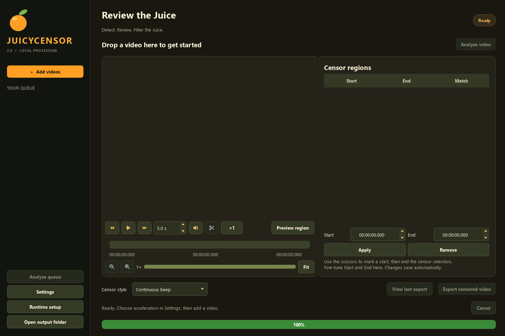

  

  <a href="https://github.com/seagullslayer7/JuicyCensor/releases/latest"><strong>Download for Windows</strong></a> ·
  <a href="#first-launch">Getting started</a> ·
  <a href="#settings-and-export">Export settings</a> ·
  <a href="https://github.com/seagullslayer7/JuicyCensor/issues">Report an issue</a>

**Filter the Juice.** A Windows desktop app that finds words and phrases in videos,
lets you review their timing, and exports a censored copy.

| Detect | Review | Export |
| :---: | :---: | :---: |
| Find your chosen words with NVIDIA, AMD/Vulkan, or CPU processing. | Fine-tune regions with scissors, timeline zoom, and precise timestamps. | Choose your destination, censor style, quality, and encoder. |

## Download

Open [GitHub Releases](https://github.com/seagullslayer7/JuicyCensor/releases/latest)
and expand **Assets**:

- **Setup.exe** — recommended. Choose the installation
  folder, optionally create a desktop shortcut, and launch the app.
- **Portable.zip** — extract the entire ZIP into a
  writable folder and open **JuicyCensor.exe**. Keep the folder together.
- **SHA256SUMS.txt** — checksums for the release downloads.

GitHub's automatic **Source code** ZIP is for developers; it is not the portable app.
The installer and portable ZIP require internet for first-run runtime/model setup.
They do not include several gigabytes of processing packages and models.

## First launch

The app asks before downloading its private processing environment. Choose:

- **AMD / Intel / CPU** for Vulkan speech transcription or CPU processing.
- **NVIDIA CUDA** for NVIDIA-accelerated speech transcription. It is a larger download.

Both choices support hardware video export when the driver and GPU support it.
Leave **Download starter English models now** selected for the quickest start.
Setup installs private Python 3.12.14, hash-pinned processing packages, FFmpeg 7.1.1,
and whisper.cpp Vulkan 1.8.4. It does not require you to install Python, Git,
Visual Studio or the CUDA Toolkit, and does not modify system Python or PATH.

Allow several GB of free space (more for CUDA and larger models). Use a folder your
Windows account can write to. Keep your graphics driver current using the GPU
manufacturer's installer. Drivers are not installed automatically.

Use **Runtime setup** to retry an interrupted setup, repair packages, or switch profiles.
Starter models are speech-recognition files downloaded during setup. If you skip
them, download a model before analyzing your first video. The default English model,
`base.en`, is small and fast. `small.en`, `medium.en`, and `large-v3` may recognize speech
more accurately, but use more storage and memory and generally process more slowly.

- **NVIDIA / CPU:** choose a model in Settings; missing files download on first use.
- **AMD / Vulkan:** select a Vulkan model, click **Download Vulkan model**, then reopen
  Settings to select and save it for use.
- Models already downloaded in this installation are reused. Changing models does
  not reinstall Python or the processing runtime. Vulkan uses a separate model format.

## Your words, your filter

The default word and phrase lists contain ordinary profanity, without identity-based
slurs. Edit them in **Settings** to choose what you want censored. Your local edits
stay on your PC; they are not automatically uploaded to GitHub. Installer upgrades
preserve your saved lists, so existing installations keep their previous choices.

## Review and censor

1. Add or drag videos into the queue. Configure words/phrases in **Settings**.
2. Choose **Analyze video** or **Analyze queue**. Review the detected regions.
3. Use playback icons, adjustable skip buttons, preview volume, and the speed slider.
4. Zoom with the magnifiers or mouse wheel; pan the timeline or choose **Fit**.
5. Click the scissors at a selection start. Use **Set censor**, **End censor** and
   **Cancel** to mark a region. Start/End fields use `HH:MM:SS.mmm`.
6. Choose a censor style and export. Detection can miss words; review before sharing.

Hover over controls for explanations. Reviews save automatically. Preview plays the
original audio; censoring is applied in the exported file. Preview speed and volume
do not change the export. Original media is never overwritten.

## Settings and export

**Processing:** Automatic prefers CUDA, then Vulkan, then CPU. Explicit unavailable
backends report an error. Vulkan uses the GPU for transcription and CPU for alignment.
The starter `.en` models are English-only; choose a multilingual model for other languages.

**Export:** Choose a destination with Browse, filename spacing, MP4 or Matroska,
video/audio encoders, quality, a 480p–4K resolution limit, frame rate and encoding speed.
Changing an individual option switches the preset to Custom. Changes apply to the next
export without reanalyzing. Resolution limits preserve aspect ratio and do not upscale.

- **Copy original video** preserves its encoded video stream, resolution and frame rate.
- **Automatic encoder** tests NVIDIA H.264, AMD H.264, Intel H.264, then CPU H.264 against
  the chosen output settings. Manual HEVC and NVIDIA AV1 choices are also available;
  hardware availability varies. Explicit unavailable choices report an error.
- **Original audio quality** targets the source bitrate when reported between 8 and
  512 kbps; otherwise it uses 192 kbps. Censoring re-encodes audio, so this is not lossless.
- AAC works with MP4 and Matroska. Opus selects Matroska automatically. MP4 here is
  standard MP4, not OBS Hybrid MP4. HEVC/AV1 playback requires a compatible player.

Speech-analysis hardware and export encoders are independent settings.

## Requirements and support

- 64-bit Windows 10 (1809+) or Windows 11.
- An up-to-date graphics driver for hardware acceleration; CPU processing is available.
- Internet for initial setup and new model downloads; processing runs locally afterward.

Tested locally on an NVIDIA RTX 5060 Ti and AMD integrated Radeon graphics. RX 9060 XT
is a target device but has not been physically tested. Do not assume identical speed
or support across all GPUs. See [VALIDATION.md](VALIDATION.md) for test coverage.

The release is not code-signed; Windows may show an unknown-publisher warning. Verify
the download's checksum against SHA256SUMS.txt on the release page.

## Files, updates and uninstalling

The chosen application folder contains its configuration, word lists, private runtime,
models, caches and logs. The default export folder is `outputs/censored` inside it;
Settings can choose another destination. Reports remain under `outputs/reports`.

Installer upgrades preserve existing config and word lists. Uninstall removes packaged
application files and shortcuts; downloaded runtime/models, user settings, caches,
reports and exports are retained. Remove those manually only if you no longer need them.
For the ZIP distribution, close the app and move the entire extracted folder together.

If something fails, check `logs/setup.log` for installation and `logs/last-job.log` for
processing. Report issues at [GitHub Issues](https://github.com/seagullslayer7/JuicyCensor/issues)
with your GPU, driver, selected model/encoder, and relevant log lines. Avoid posting
private video content or sensitive paths.

## Development and releases

See [BUILDING.md](BUILDING.md). Dependency updates are resolved and tested before release;
setup deliberately installs pinned compatible versions instead of blindly installing
the newest packages. WhisperX 3.8.6 requires PyTorch 2.8.x.

Application code is MIT licensed. Bundled/downloaded components have their own licenses:
see [THIRD-PARTY.md](THIRD-PARTY.md) and the `licenses` folder.
