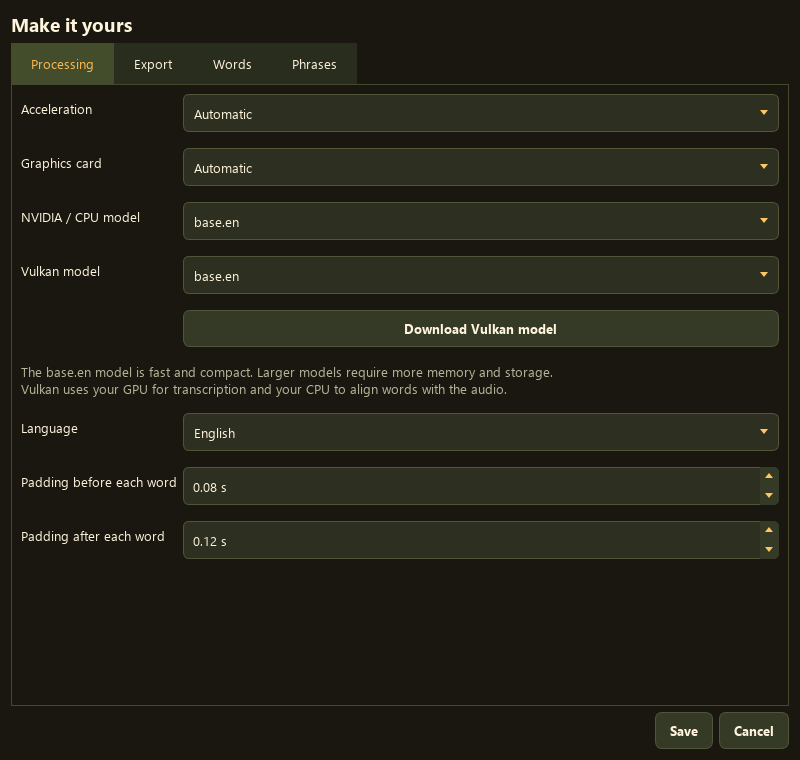
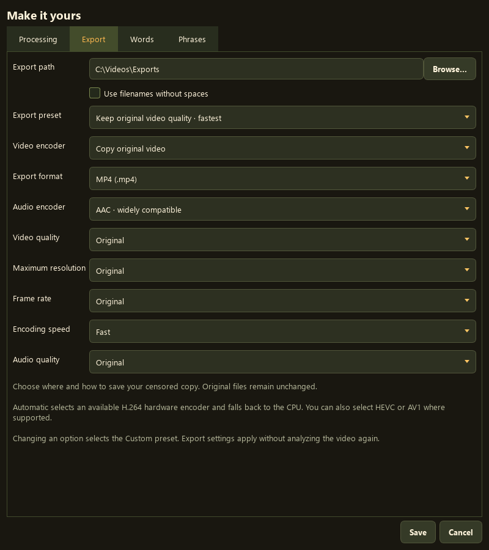

  

  <a href="https://github.com/seagullslayer7/JuicyCensor/releases/latest"><strong>Download for Windows</strong></a>
  &nbsp; | &nbsp; <a href="#quick-start">Quick start</a>
  &nbsp; | &nbsp; <a href="#settings">Settings</a>
  &nbsp; | &nbsp; <a href="https://github.com/seagullslayer7/JuicyCensor/issues">Get help</a>

Find words and phrases in your videos, fine-tune the censor regions, and export a filtered copy. Processing runs locally on your PC.

  

## Quick start

1. **Install.** Get **Setup.exe** from the [latest release](https://github.com/seagullslayer7/JuicyCensor/releases/latest). Choose your folder and launch the app.
2. **Set up.** Choose **NVIDIA CUDA** or **AMD / Intel / CPU**. Leave starter models selected; setup downloads the required tools.
3. **Analyze.** Add a video, customize your word lists in **Settings**, and click **Analyze video**.
4. **Review and export.** Check the detected regions, adjust their timing, choose a censor style, and export.

**Windows 10 (1809+) or Windows 11, 64-bit.** Initial setup needs internet and several GB of free space. No separate Python or CUDA Toolkit installation is needed.

Prefer a portable copy? Extract **Portable.zip** and open **JuicyCensor.exe**. Keep the extracted folder together. GitHub's **Source code** archive is for developers.

> Preview plays the original audio. Censoring is applied to the exported video, and the original file stays untouched. Always review detected regions before sharing.

## Settings

<table>
  <tr>
    <th width="50%">Processing</th>
    <th width="50%">Export</th>
  </tr>
  <tr>
    <td valign="top" align="center">
      
      
Choose your GPU, speech model, language, and timing padding.

    </td>
    <td valign="top" align="center">
      
      
Choose an output folder, quality preset, resolution, and encoder.

    </td>
  </tr>
</table>

Click either screenshot to view it full size.

**Your filter:** add or remove words and phrases in Settings. The included lists provide a starting point with common profanity.

**Your review:** use scissors to mark regions, magnifiers to zoom the timeline, and Start/End fields for precise adjustments. Hover over controls for help.

<strong>Choosing and downloading a speech model</strong>

`base.en` is the small, fast English starter model. `small.en`, `medium.en`, and `large-v3` can improve recognition, but need more storage, memory, and processing time. Models ending in `.en` are English-only; `large-v3` supports multiple languages.

- **NVIDIA / CPU:** select a model in Settings. Missing files download on first use.
- **AMD / Vulkan:** select a model and click **Download Vulkan model**. Reopen Settings, select it, and save.
- Downloaded models are reused. Vulkan and NVIDIA/CPU use separate model formats.

Automatic acceleration prefers CUDA, then Vulkan, then CPU. Vulkan uses the GPU for transcription and CPU for word alignment. GPU compatibility depends on hardware and drivers; see [tested hardware and limitations](VALIDATION.md).

<strong>Understanding export quality</strong>

| Option | What it does |
| --- | --- |
| Keep original video quality | Copies the video stream without re-encoding it. |
| High / Balanced / Smaller file | Trades file size against video quality. |
| Custom | Selected automatically when you change an individual option. |
| Automatic encoder | Uses a working H.264 hardware encoder, with CPU fallback. |
| Maximum resolution | Limits output from 480p to 4K without stretching or upscaling. |
| Original audio quality | Targets the source bitrate, or 192 kbps when unavailable. Censoring still re-encodes audio. |

MP4 with AAC offers broad compatibility. Opus uses Matroska. HEVC and AV1 require compatible hardware and players. Export settings apply without analyzing again; preview volume and playback speed do not affect the export.

## Updates and help

**Updating:** close the app and run the latest installer into the **same folder**. It preserves settings, word lists, and downloaded models.

**Error 448 during Python setup?** Update to **2.0.3 or newer**. Setup verifies the downloaded interpreter and continues if only the optional Python version link was blocked.

**WinError 1314 during model download?** Update to **2.0.2 or newer**, then retry. Administrator privileges and Developer Mode are not required.

<strong>Portable updates, files, and uninstalling</strong>

For a portable update, extract the new ZIP separately and copy its contents into your existing app folder. Replace app files, but preserve `config.json`, `banned_words.txt`, and `banned_phrases.txt`. Keep the `cache`, `models`, `runtime`, and `venv` folders.

By default, exports go to `outputs/censored`; choose a different destination in Settings. Reports are stored in `outputs/reports`.

Uninstalling removes packaged application files and shortcuts. Downloaded models, runtime files, settings, caches, and exports are retained. Remove those manually only when no longer needed.

Use **Runtime setup** to retry or repair dependency setup. For other problems, [open an issue](https://github.com/seagullslayer7/JuicyCensor/issues) with your GPU, driver, and relevant lines from `logs/setup.log` or `logs/last-job.log`.

The app is unsigned, so Windows may show an unknown-publisher warning. Release downloads include `SHA256SUMS.txt` for verification.

---

[Build from source](BUILDING.md) | [Release notes](RELEASE-NOTES.md) | [Validation](VALIDATION.md) | [MIT license](LICENSE) | [Third-party notices](THIRD-PARTY.md)
