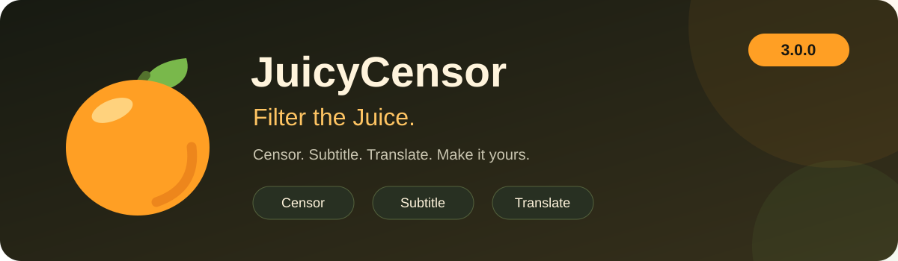
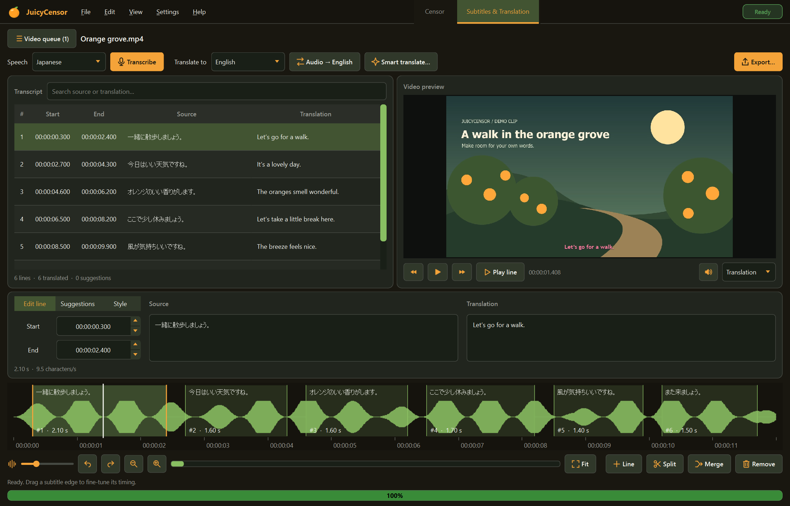
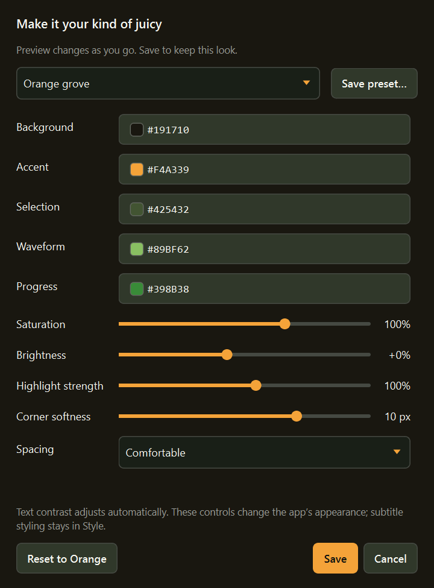
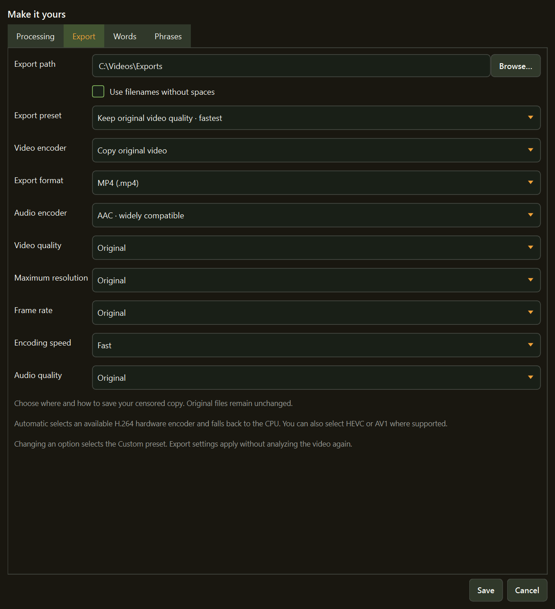
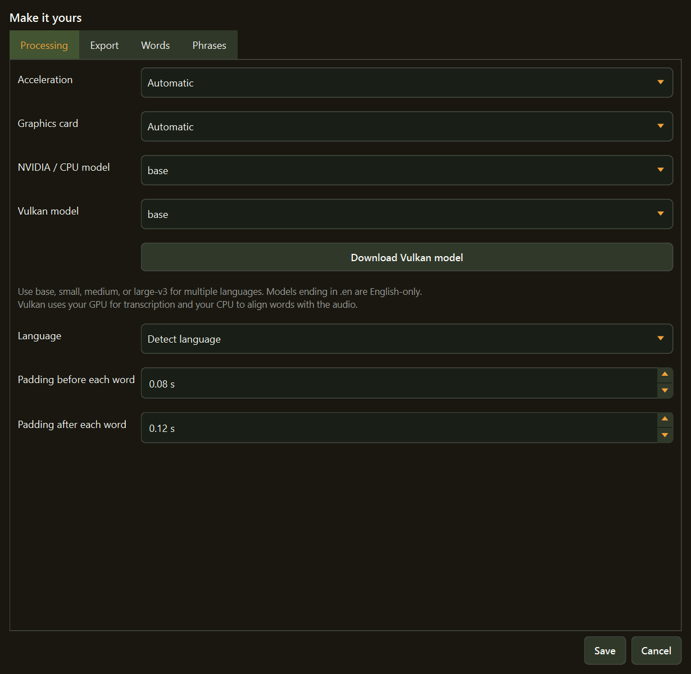

<strong>Censor dialogue · Create subtitles · Translate with context</strong> Local speech processing for Windows, in one customizable workspace.

<a href="https://github.com/seagullslayer7/JuicyCensor/releases/download/v3.0.0/JuicyCensor-3.0.0-Windows-x64-Setup.exe"><strong>Download installer</strong></a> · <a href="https://github.com/seagullslayer7/JuicyCensor/releases/download/v3.0.0/JuicyCensor-3.0.0-Windows-x64-Portable.zip">Portable ZIP</a> · <a href="https://github.com/seagullslayer7/JuicyCensor/releases/tag/v3.0.0">3.0.0 release notes</a>

JuicyCensor 3.0.0 with illustrative subtitles in a demonstration clip.

## Meet JuicyCensor 3.0

| Filter the Juice | Find the right words | Make it yours |
| --- | --- | --- |
| Detect words and phrases, adjust censor regions, and listen before exporting. | Transcribe multiple languages, edit both subtitle tracks, and review translation suggestions. | Drag timing blocks on the waveform and customize the app's colors, highlights, and spacing. |

## Get started

1. **Install** with Setup.exe, or extract the entire portable ZIP to a writable folder.
2. **Run JuicyCensor.** First-run setup offers a private processing environment and optional starter models. Choose CPU/Vulkan or NVIDIA CUDA support.
3. **Open a video** from File or drag it into the app. Choose **Censor** or **Subtitles & Translation** at the top.

**Windows 10 (1809+) or Windows 11, 64-bit.** NVIDIA uses CUDA; AMD and Intel use Vulkan; CPU processing is also available. Keep your graphics driver current. System Python, the CUDA Toolkit, and Visual Studio are not required. The app is unsigned, so Windows may show a publisher warning.

## Censor your video

Choose words and phrases in **Settings**, then **Analyze video**. Review the matches, add a selection with the scissors button, or drag the edges of a region on the waveform. Switch between **Original audio** and **Censored audio** to hear the result before exporting.

The included lists contain ordinary English profanity, without identity-based slurs. Add your own words and phrases for other languages. The **Transcript** tab inside Censor lets you search the detected dialogue and jump to a timestamp.

## Subtitle and translate

1. Choose the spoken language and **Transcribe**, or import an SRT, VTT, ASS, or saved project.
2. Edit source text and timing. Drag a waveform block to move it; drag either edge to trim it.
3. Use **Audio → English** for local Whisper translation, or **Smart translate** for suggestions from a text model. Review and accept the suggestions you want.
4. Choose subtitle font, size, and color in **Style**, then **Export**.

| Export | What you get |
| --- | --- |
| SRT / VTT | Plain subtitle files. |
| ASS | Styled subtitles. |
| MP4 | Styled subtitles permanently rendered into the video. |
| MKV | A switchable styled subtitle track, with original video/audio copied. |

Save a **.juice.json project** with **Ctrl+S** to keep both languages, timing, style, scene notes, and pending suggestions together. Video projects also autosave locally. Undo/Redo covers subtitle text, timing, style, splits, merges, and accepted suggestions.

## A workspace that fits

Use **View → Appearance** to preview Orange grove, Midnight, Berry, or Graphite, then adjust colors, saturation, brightness, highlights, spacing, and corners. Save your own named presets or reset to Orange. Cancel restores your previous look. Subtitle styling is controlled separately in **Style**.

<strong>See appearance and export settings</strong>

Export presets cover resolution from 480p to 4K, quality, frame rate, video encoder, audio, and destination. Changing individual values switches the preset to Custom. Keep original video quality avoids video re-encoding for censor exports; subtitle burn-in requires encoding.

<strong>Models, languages, and quiet speech</strong>

- The optional starter speech model is multilingual **base**. Skipping it saves the initial download; selecting a missing model later can require a download.
- Larger multilingual models such as **small**, **medium**, and **large-v3** can improve recognition, with higher memory and storage needs. Results depend on the audio.
- NVIDIA/CPU and Vulkan use different model formats. Matching downloads are reused. NVIDIA/CPU models download when needed; use Settings to download a Vulkan model.
- English-only **.en** models cannot process other languages or automatic language detection. When upgrading from 2.x, choose a multilingual model and the appropriate speech language.
- **Quiet speech / whispers** disables voice-activity filtering for subtitle recognition on NVIDIA/CPU. Vulkan already runs without that filter. Review quiet sections for missed or invented speech.
- Automatic censorship also needs a compatible word-alignment model, which may download on first use. Subtitle transcription does not require forced alignment.

<strong>Translation, privacy, and editor details</strong>

**Local by default.** Audio → English uses Whisper on your PC. Smart translate can use a separately installed local text-model server, such as Ollama or a compatible server, to translate or refine text with nearby lines and **Edit → Scene notes**. Text models are optional and are not bundled.

**Optional online AI.** Smart translate can use a compatible HTTPS chat-completions service with your own API key. The dialog explains which subtitle text and context will be sent; it does not upload video or audio. API keys stay in memory for that app session. Provider charges may apply.

Suggestions do not overwrite source text or timing. Review them before accepting, especially for quiet dialogue, ambiguous names, or incomplete sentences. Select lines to process a group; clear the selection to process all lines.

**Timing and navigation.** The waveform loads automatically in the background. Scroll to zoom, Shift+scroll to pan, and click the ruler to seek. Its height slider makes quiet audio easier to see without changing playback volume. Esc cancels a timing drag. Hover over pane edges to resize; View → Reset panel layout restores the defaults. F11 toggles full screen. The queue's × button removes an entry while keeping the video and saved edits.

**Format details.** Source and translation export separately. Incomplete translation tracks must be filled before export. ASS import reads text and timing; imported styles and complex effects are not retained. MP4 burn-in re-encodes the picture and copies compatible audio. MKV playback styling depends on the player and available fonts.

**Separate workspaces.** The subtitle editor uses its own transcription or imported subtitles; it does not automatically reuse the Censor transcript. Censored playback prepares a cached copy using the export filters, so the first preview needs processing time and temporary disk space.

<strong>Updating from an earlier version</strong>

Close JuicyCensor and run the 3.0.0 installer into your existing installation folder. It replaces application files while preserving settings, word lists, appearance preferences, projects, and downloaded models/runtime files. Existing compatible processing environments are reused.

For a portable update, back up your folder first. Preserve `config.json`, `banned_words.txt`, `banned_phrases.txt`, `appearance.json`, projects, and your existing cache/model/runtime folders while replacing the application files. Downloading a ZIP alone does not update an installation; extract and copy its contents, or use the installer.

## Project

[Report an issue](https://github.com/seagullslayer7/JuicyCensor/issues) · [Release history](https://github.com/seagullslayer7/JuicyCensor/releases) · [Build instructions](BUILDING.md) · [Validation](VALIDATION.md) · [Third-party licenses](THIRD-PARTY.md)
